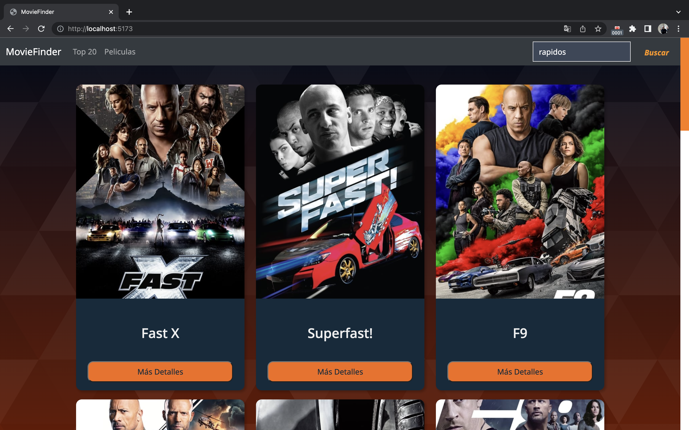
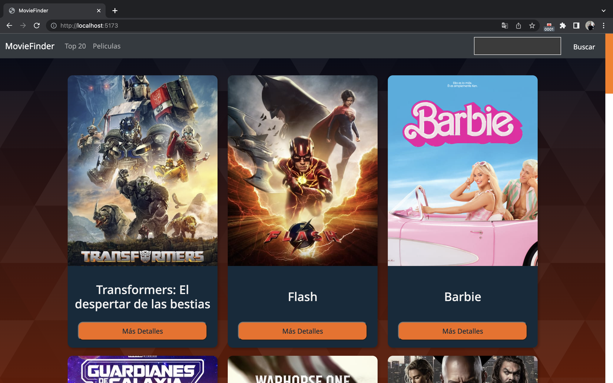
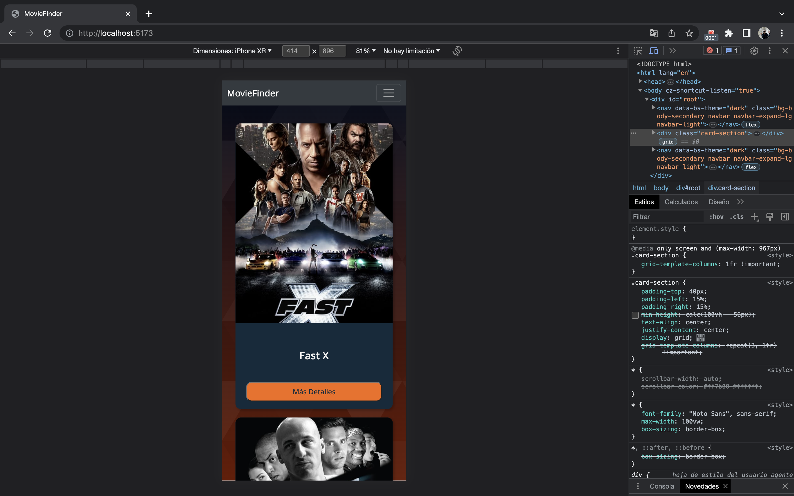
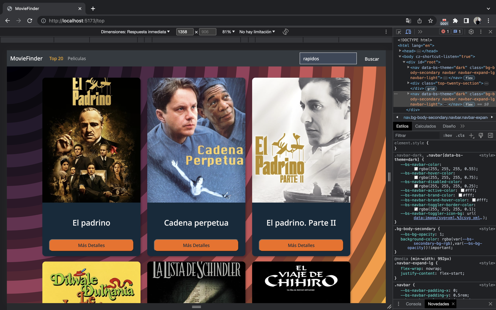
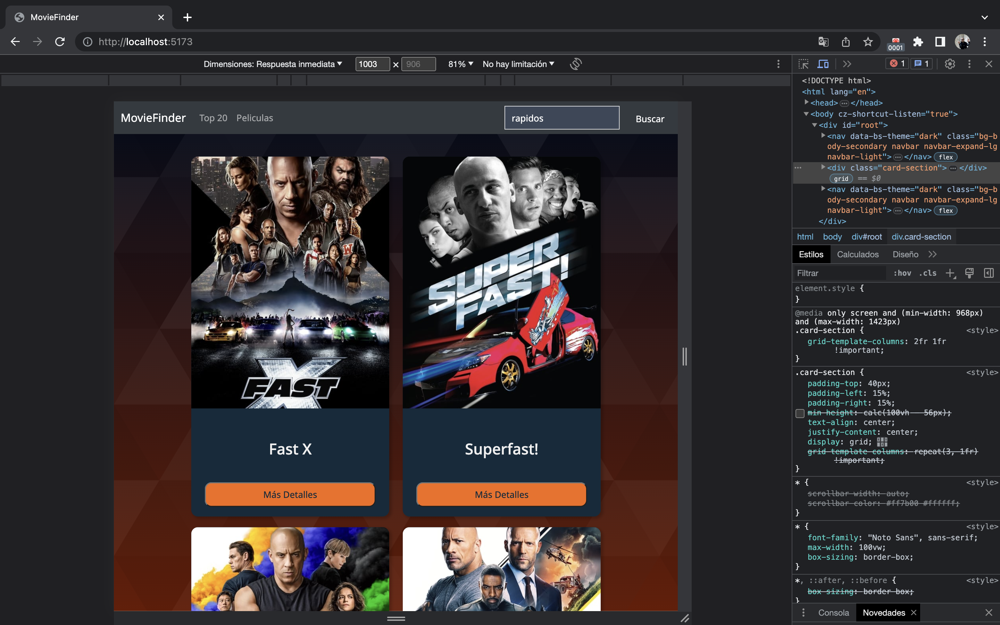

# Proyecto-Movie-React

<details>
  <summary>Contenido 📝</summary>
  <ol>
    <li><a href="#objetivo-🎯">Objetivo</a></li>
    <li><a href="#sobre-el-proyecto-🔎">Sobre el proyecto</a></li>
    <li><a href="#deploy-🚀">Deploy</a></li>
    <li><a href="#stack">Stack</a></li>
    <li><a href="#instalación-en-local">Instalación</a></li>
    <li><a href="#vistas">Vistas</a></li>
    <li><a href="#futuras-funcionalidades">Futuras funcionalidades</a></li>
    <li><a href="#contribuciones">Contribuciones</a></li>
    <li><a href="#licencia">Licencia</a></li>
    <li><a href="#webgrafia">Webgrafia</a></li>
    <li><a href="#desarrollo">Desarrollo</a></li>
    <li><a href="#agradecimientos">Agradecimientos</a></li>
    <li><a href="#contacto">Contacto</a></li>
  </ol>
</details>

## Objetivo 🎯

Es el primer proyecto de React y requeria traer datos de una Api (The Movie Database), utilizar Redux y manejar los elementos con carga dinamica.

## Sobre el proyecto 🔎

Decidi darle bastante enfasis a la parte visual, se implemento un buscador.
Se utilizo typescript para continuar adquiriendo expericia con dicha tecnologia y agregarle un poco mas de complejidad al proyecto.

<!-- ## Deploy 🚀

<div align="center">
    <a href="https://www.google.com"><strong>Url a producción </strong></a>🚀🚀🚀
</div> -->

## Stack

<div align="center">
<a href="https://www.reactjs.com/">
    
</a>
<a href="https://www.typescriptlang.org/es/docs/handbook/">
    
</a>

 

  

   
 </div>

1. Clonar el repositorio
2. `$ npm install`
3. `$ npm run dev`
4. ...

## Vistas

Landing
  
Register

Login

Profile

Routines

Exercices


## Futuras funcionalidades

✅ Buscador  
⬜ Incluir series.  
⬜ Paginacion
⬜ ...

## Contribuciones

Las sugerencias y aportaciones son siempre bienvenidas.

Puedes hacerlo de dos maneras:

1. Abriendo una issue
2. Crea un fork del repositorio
   - Crea una nueva rama
     ```
     $ git checkout -b feature/nombreUsuario-mejora
     ```
   - Haz un commit con tus cambios
     ```
     $ git commit -m 'feat: mejora X cosa'
     ```
   - Haz push a la rama
     ```
     $ git push origin feature/nombreUsuario-mejora
     ```
   - Abre una solicitud de Pull Request

## Licencia

Este proyecto se encuentra bajo licencia de "Maxi Chavez"

## Webgrafia:

Para conseguir mi objetivo he recopilado información de:

- Ejemplos del Bootcamp
- Documentacion oficial.
- ...

## Herramientas para el desarrollo:

- https://css.glass/ => Para el efecto en el div que contiene el detalle.
- https://www.svgbackgrounds.com/ => Para el fondo de pantalla de ambas vistas.

## Desarrollo:

```js
const developer = "MaxiChavez";

console.log("Desarrollado por: " + developer);
```

## Agradecimientos:

Agradezco a mis compañeros el tiempo dedicado a este proyecto.

- _Alvaro_
- **David**
- **_Francisco_**

## Contacto

<a href = "mailto:chavezmaxi@gmail.com"></a>
<a href="https://www.linkedin.com/in/linkedinUser/" target="_blank"></a>

</p>
